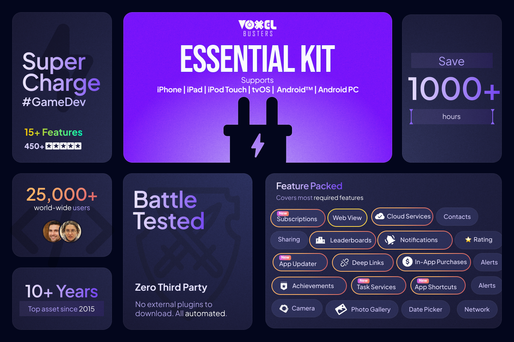

# Introduction

### **Essential Kit (V3)** a true cross-platform tool for Unity which provides unique and unified way to access native functionality on mobile platforms.

> Supports **mobile** platforms **iOS 15+ (till iOS 17)** | **Android 21+**

> **450+** 🌟🌟🌟🌟🌟 | Used by **25,000+ developers** world-wide

> As promised, all customers get [Ads Kit](https://u3d.as/37du "https://u3d.as/37du") for Free - No Code Required!

* * *

#### **Important links**

[Unity Forum Thread](https://link.voxelbusters.com/essential-kit-unity-forum) | [Tutorials](https://link.voxelbusters.com/essential-kit-tutorials)  | [API Reference](https://link.voxelbusters.com/essential-kit-api) | [Support](https://link.voxelbusters.com/essential-kit-support)

 

#### **Highlights:**

• **Unified** API design | **Never write** code **per platform**

• **Easy** installation

• No **knowledge** of native platform **services is required**

• **Simulate** most feature **behavior in the** Editor

• Generate Android **manifest** and **permissions** **as per** feature **usage**

• Automatically adds required **capabilities** on iOS

• Only **select features** you need

• Complete **ASMDEF**

• Full **source code** is included

• Detailed **tutorials** with native platform setup

• **Unity cloud build** and batch mode compatible

• Actively supported **since 2015**

 

**Feature set**  

• @ref AddressBook "Address Book" - Access **contacts** of the user

• @ref AppUpdater "App Updater" \- Prompt version updates to user

• @ref BillingServices "Billing Services" \- **Privacy First** In-App purchases (Consumables/Non-Consumables/**Subscriptions**)

• @ref CloudServices "Cloud Services" - **Save** data in the **cloud** (iCloud & Saved Games)

• @ref DeepLinkServices "Deep Link Services" - Connect your content/screen with a url

• @ref GameServices "Game Services" - **Leaderboards**, **Achievements** done right

• @ref SharingServices "Mail Sharing" - **Share** data through **mail**

• @ref SharingServices "Message Sharing" - **Share** data as **messages**

• @ref MediaServices "Media Services" - **Select, Capture, Save** media content (Gallery/Camera)

• @ref NativeUI "Native UI" - Popups (Alert Dialog, Date/Time Picker (New!) - Native alerts

• @ref NetworkServices "Network Connectivity" - Check **network connection**

• @ref NotificationServices "Local Notifications" - Schedule time or calender **notifications**

• @ref NotificationServices "Remote/Push Notifications" - Receive **remote** **notifications**

• @ref RateMyApp "Rate My App" - Get **ratings**

• @ref SharingServices "Social Sharing" - Share to **social media** (Facebook, Twitter, WhatsApp)

• @ref SharingServices "Share Sheet" \- Share images, videos, urls etc

• @ref WebView "Web View"- Access **browser** within Unity

 

**Note**  

• Plugin doesn't include Facebook SDK.

• Works with Unity Cloud Build.

• You need to add "com.unity.nuget.**newtonsoft**\-json": "2.0.0" in Packages/manifest.json

* * *

**You might be interested in our other products**  

[Cross Platform **Ads Kit**](https://u3d.as/37du "https://u3d.as/37du") **(FREE with Essential Kit)**

[Cross Platform **Screen Recorder Kit**](http://u3d.as/1nN3 "http://u3d.as/1nN3")

[**Easy ML Kit**](https://u3d.as/2PMe "https://u3d.as/2PMe")

[Reporting Kit](https://u3d.as/2Q6p "https://u3d.as/2Q6p")

[Cross Platform **Snapchat Kit**](http://u3d.as/1gWc "http://u3d.as/1gWc")

[Cross Platform **Story Kit(Instagram)**](http://u3d.as/1pMn "http://u3d.as/1pMn")

 

**If you are upgrading from version 2.x, please follow** [**this guide**](https://assetstore.essentialkit.voxelbusters.com/upgrades/version-2.0.0 "https://assetstore.essentialkit.voxelbusters.com/upgrades/version-2.0.0")**.**

 

#### **Third Party Plugins Compatibility**
• Plays nicely with [Anti-Cheat Toolkit](https://assetstore.unity.com/packages/slug/202695){:target="_blank"}
