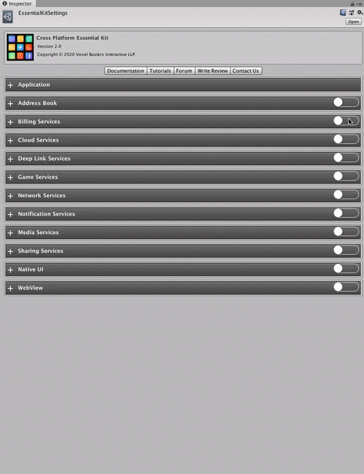

# Setup

Before using any of the billing products, we need to configure them in the [Essential Kit Settings](../../overview/settings.md) under billing services.

## Enable Feature

Open [Essential Kit Settings](../../overview/settings.md) and enable Billing Services feature in the inspector.

### Properties

| Name                                            | Description                                                                                                                                    |
| ----------------------------------------------- | ---------------------------------------------------------------------------------------------------------------------------------------------- |
| Products                                        | 
Collection of In-App purchase Billing products  (Billing Products - See below)
                                                       |
| Maintain Purchase History                       | Enabling this stores the non-consumable purchases on device locally                                                                            |
| Auto Finish Transactions                        | Automatically close the transaction once the purchase is done. Disabling this requires you to manually call **FinishTransactions**             |
| Verify Transaction Receipts                     | Enabling this allows the plugin to do an internal verification once after the purchase for additional security. Recommended to set it to true. |
| iOS Properties (Custom verification server url) | You can set a custom verification server url if you have your own server which validates the receipt (TODO : Get the url format)               |
| Android Properties (Public Key)                 | Enter the public key from google play console ([reference](android.md))                                                                        |

## Billing Products

Billing product is a container to hold your in-app purchase identifiers for different platforms. Each billing product has a unique **Id** to identify them. Id helps in referring an in-app purchase from your code irrespective of the platform you are on and this can be any string of your choice.

Platform Id on the other hand, is the actual platform specific identifier and usually varies per platform. Specify the value in platform overrides, if you don't have a common identifier among platforms.&#x20;


You can get **platform id** value from [iTunes Connect](ios.md#create-an-in-app-purchase) and [Google Play console](android.md#create-in-app-products) on  iOS and Android respectively.&#x20;


### Types

You can have your purchasable items both Consumable and Non-Consumable.

| Product Type   | Description                                                                                                    |
| -------------- | -------------------------------------------------------------------------------------------------------------- |
| Consumable     | 
In-App products which can be purchased multiple times

ex: Virtual coins pack, Bullets pack etc...
 |
| Non-Consumable | 
In-App products which can be purchased only once

ex: Ad-Free offering, Level packs etc...
         |

### Properties

| Billing Product Property Name | Description                                                                                                                                                  |
| ----------------------------- | ------------------------------------------------------------------------------------------------------------------------------------------------------------ |
| Id                            | Identifier given to refer the billing product from code                                                                                                      |
| Platform Id                   | Common native platform id, if any                                                                                                                            |
| Platform Id Overrides         | If you have specific billing product id's on each platform, set them here.                                                                                   |
| Product Type                  | 
Consumable : In-App products which can be purchased multiple times

Non-Consumable : In-App products which can be purchased only one time
 |
| Title                         | Title for this In-App billing product (will be useful for displaying available billing products)                                                             |
| Description                   | Description for this In-App billing product (will be useful for displaying available billing products)                                                       |

