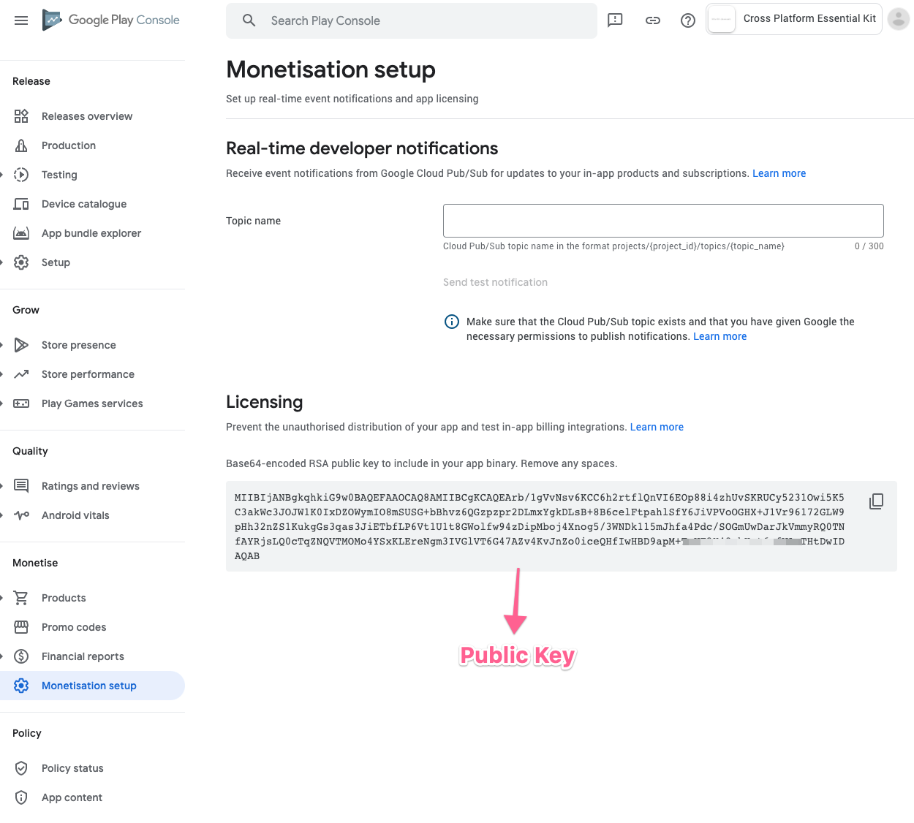

# Android


To enable billing on Android, you first need to upload your app to play store in any of alpha/beta / internal track's.


## Create In-App products

Once after  uploading the app and publish in any of the tracks, you will get an option to add in-app products.&#x20;

## Public Key

> ### Public key needs to be set in the [Essential Kit Settings](./#properties) and can be obtained from Monetisation Setup of Monetise section.

###


Public key is used internally by the plugin to validate a purchased receipt on Android


