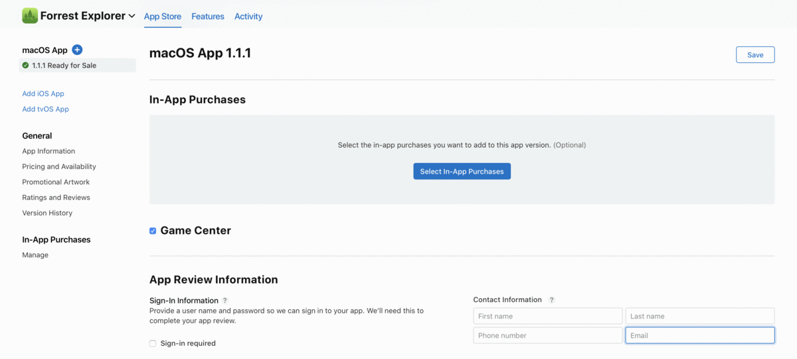

# iOS

## Configure in App Store Connect

Configure  in‑app purchases in[ App Store Connect](https://appstoreconnect.apple.com/), and include details such as name, pricing, and description that highlights the features and functionality of your in‑app purchase.&#x20;

### Create an in-app purchase

1. From My Apps, select your app.
2. In the sidebar under In-App Purchases, click Manage.
3. To add an in-app purchase, go to In-App Purchases and click the Add button (+).
4. Select Consumable, Non-Consumable, or Non-Renewing Subscriptions and click Create.
5. Add the reference name, product Id, and a localized display name.
6. Click Save, or Submit for Review.


### Product Id you set in step 5 needs to be used as Platform Id in [Billing Services settings](./#billing-products) for iOS platform.


### **Publish your app and in-app purchase on the App Store**

When you are done testing your in-app purchases, you'll be able to submit for review. Check its in-app purchase status to make sure you aren't missing information and ensure that you've selected your in-app purchase pricing. Products are reviewed when you submit your app as part of the app review process.


For in-app purchases to work, you need to make sure you finish your tax and legal agreements on App Store Connect. Else, you won't get any results when you fetch the billing product details.


