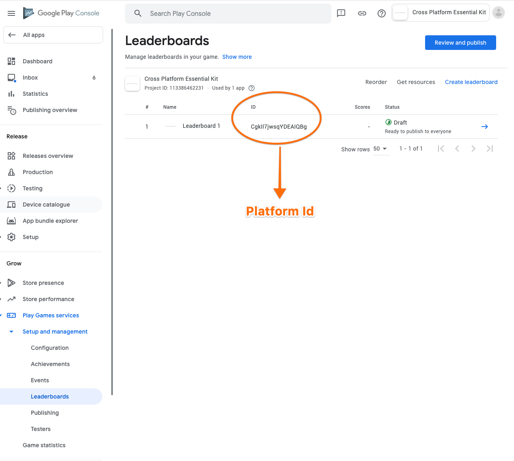
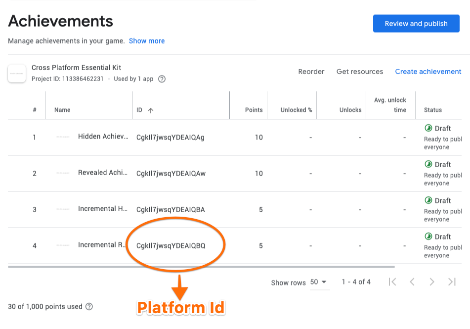

# Android

Plugin uses Google Play Services to provide the functionalities of Game Services.

> Google Play games services save you from having to implement popular game features yourself. Using the google game play services you can help players to challenge themselves and measure themselves against others, and receive rewards. Players who take advantage of Google Play games services features are more likely to engage with and make purchases from your game.

## Configuring Leaderboards

> For creating a new Leaderboard

1. Navigate to [Google Play Console](https://play.google.com/apps/publish) and select your app
2. Select Grow -> Play Games Services -> Setup and Management -> Leaderboards tab on the left and click on **Create Leaderboard**
3. Input your leaderboard metadata. For more information, see [Leaderboard properties](https://developers.google.com/games/services/common/concepts/leaderboards#the\_basics).
   * Name
   * Format
   * Icon
   * Sort Order
   * Tamper protection (optional)
   * Limits (Optional)
   * Order
4. &#x20;Click Save


Once after saving the created leaderboard, you can see the leaderboard id  in the leaderboards section and this will be the **platform Id** for Android platform on [Essential Kit Settings](./#properties) for each leaderboard you configure.


## Configuring Achievements

> For creating a new Achievement

1. Navigate to [Google Play Console](https://play.google.com/apps/publish) and select your app
2. Select Grow -> Play Games Services -> Setup and Management -> Achievements tab on the left and click on **Create Achievement**
3. Input your leaderboard metadata. For more information, see [Leaderboard properties](https://developers.google.com/games/services/common/concepts/leaderboards#the\_basics).
   * Name
   * Description
   * Icon
   * Incremental Achievements (If enabled [NumberOfStepsToUnlock](./#properties) will be the value thats set here. Else it will be 1)
   * Initial state (Revealed/Hidden)
   * Points
   * List Order
4. &#x20;Click Save


Once after saving the created leaderboard, you can see the achievement id  in the achievements section and this will be the **platform Id** for Android platform on [Essential Kit Settings](./#properties) for Achievements for each achievement you configure.


## Configuring Credentials (SHA fingerprint authentication)

For using google play services, the player needs to login. For logging in successfully, the apk from which the player is logging in needs to be authenticated by google servers.

One way google servers authenticate is by checking if the request is from an apk/aab which has a valid SHA fingerprint added in the google play console.


For your apk to login successfully, you need to add a SHA fingerprint to google play console. This makes google servers aware that your apk requests are valid.


### Adding a SHA fingerprint?

1. Navigate to [Google Play Console](https://play.google.com/apps/publish) and select your app
2. Select Grow -> Play Games Services -> Setup and Management -> Configuration tab on the left and click on **Add Credential**
3. If you are accessing login from your Android apk, select Android else Game Server for type
4. Under Authorization section
   1. Click on Create OAuth Client button
   2. Open **Create OAuth Client Id**&#x20;
   3. Enter your package name
   4. Fill in the SHA fingerprint (For creating one, check [FAQ](../faq.md#what-are-different-sha-fingerprints-that-needs-to-be-used-for-logging-in-successfully-on-different-environments-and-how-to-create-them))
   5. Click Save
   6. Come back to Authorization section (step 4) and select the created OAuth client
5. Click on Save

### Authenticate APK's built in different environments

There are usually 3 environments when creating the apk/aab and each environment uses a different keystore leading to a unique SHA

* Debug - Uses default android debug keystore when development build is on
* Release - Uses release key store when release build is on
* Play Store - Uses google play signing keystore for all the apks downloaded from play store( including tracks - Alpha/Beta)

If you want to login successfully in the apk's built in those above environments, you need to add credential in Google play console by repeating the process mentioned above(**Adding a SHA fingerprint**) for each SHA fingerprint.


For authenticating successfully, SHA fingerprint of the built APK needs to be added in the Google play console -> Play Games Services -> Setup and Management -> Configuration -> Credentials section.



99% of the errors related to sign in failure are because of not adding the SHA of your apk thus letting the google servers to block the login.&#x20;

