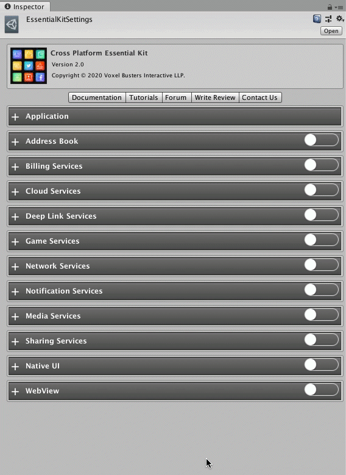

# Setup

## :white\_check\_mark: Enable Feature

Open [Essential Kit Settings](../overview/settings.md) and enable Media Services feature in the inspector.

### Properties

| Name                   | Description                                                  |
| ---------------------- | ------------------------------------------------------------ |
| Uses Camera            | Enable this if you are accessing any camera related features |
| Uses Gallery           | Enable this if you are reading from the device's gallery     |
| Saves Files to Gallery | Enable this if you are saving files to device gallery        |


You need to enable the required properties as per the usage as these automatically add the required permissions on the native platforms.

