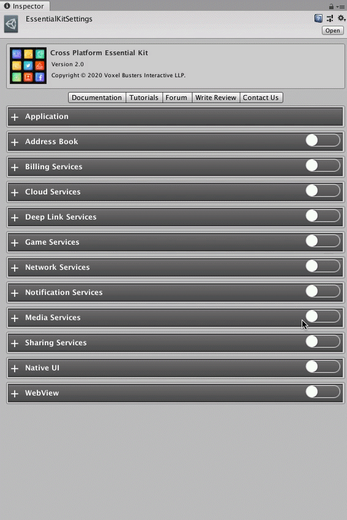

# Setup

## :white\_check\_mark: Enable Feature

Open [Essential Kit Settings](../overview/settings.md) and enable Network Services feature in the inspector.

### Properties

| Name                | Description                                                                                                                                                                                                                                                                                                                                                    |
| ------------------- | -------------------------------------------------------------------------------------------------------------------------------------------------------------------------------------------------------------------------------------------------------------------------------------------------------------------------------------------------------------- |
| Host Address        | 
ipv 4 : Ip 4 address of the server to check

ipv 6 : Ip 6 address of the server to check
                                                                                                                                                                                                                                                           |
| Auto Start Notifier | Enabling this will auto start detecting network status as soon as the app launches                                                                                                                                                                                                                                                                             |
| Ping Settings       | 
<strong>Max Retry Count :</strong> Number of times to retry before reporting failure status

<strong>Time Gap Between Polling :</strong> Time gap between two network call checks

<strong>Time Out Period :</strong> Time to consider for a request timeout

<strong>Port :</strong> Port to ping on the remote server while connecting
 |

