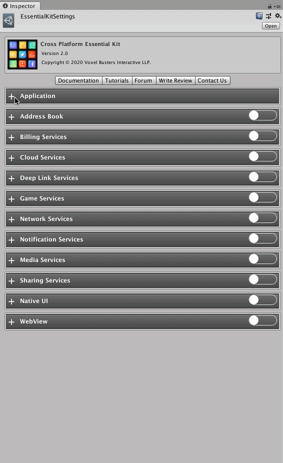

# Settings

## Essential Kit Settings



Essential Kit Settings is the control panel for all the features covered in [**Cross Platform Essential Kit**](http://u3d.as/1szE).\
You can enable and disable the features based on your requirement.&#x20;


Add the following dependencies in manifest.json (if not added)

* <mark style="background-color:purple;">"com.unity.nuget.</mark><mark style="background-color:purple;">**newtonsoft**</mark><mark style="background-color:purple;">-json": "2.0.0"</mark>


Access the settings from **Window -> Voxel Busters -> Native Plugins -> Essential Kit -> Open Settings**


Once you import the plugin for the first time, you need to access the Essential Kit Settings for enabling the features you want to use.


Enable the features you want to use and disable the rest.


Disabling the features that you don't use will let the plugin to not export the features that are unused.


Application Settings is common to all features and the values need to be set before you publish the app to app stores.

| Properties                | Description                                                                                                                                                                                                                                                                                                                                                                                     |
| ------------------------- | ----------------------------------------------------------------------------------------------------------------------------------------------------------------------------------------------------------------------------------------------------------------------------------------------------------------------------------------------------------------------------------------------- |
| Log Level                 | Setting to None will disable all logs from the plugin. Set it to Critical to show the main    critical logs or set to info for more debugging                                                                                                                                                                                                                                                   |
| App Store Ids             | 
iOS : Set the "<strong>Apple Id</strong>" value from <a href="https://appstoreconnect.apple.com/apps">Appstore Connect</a> -> Select your App -> General  -> App Information -> General information (check below screenshot ). This is a numeric value. Ex: 1210072186

 

Android : Set the <strong>package name</strong> of your app here. Ex: com.voxelbusters.essentialkit
 |
| Usage Permission Settings | 
These are the descriptions shown when a permission is shown on the native platform. Currently these descriptions are shown only on iOS as on Android it's not possible to have custom permission messages. 

<strong>$productName</strong> will be replaced with the app product name
                                                                                         |

## [External Dependency Manager](https://github.com/googlesamples/unity-jar-resolver)

Plugin uses [**External Dependency Manager**](https://github.com/googlesamples/unity-jar-resolver) for resolving the dependencies on Android. In order to resolve the dependencies once after selecting the features you want to use, activate Force Resolve to download the required libraries.


Activate Force Resolve from Assets -> External Dependency Manager -> Android Resolver -> Force Resolve


