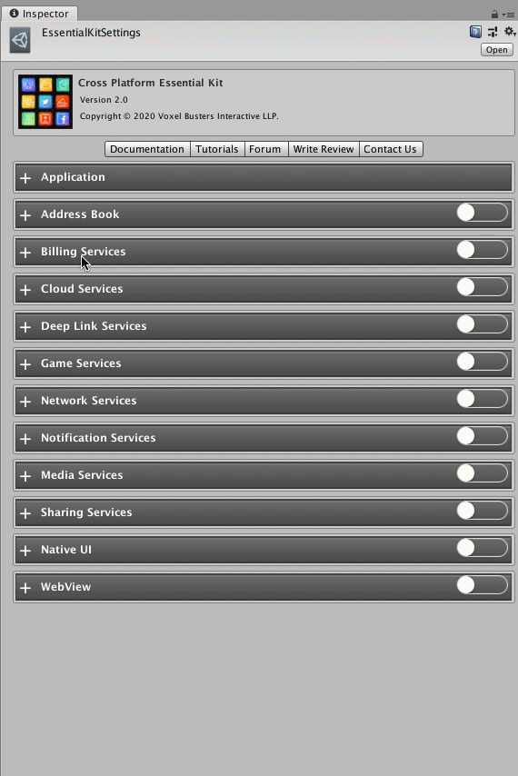

# Setup

## :white\_check\_mark: Enable Feature

Open [Essential Kit Settings](../overview/settings.md) and enable Rate App feature in the inspector.

### Properties



#### Confirmation Dialog Settings

Confirmation dialog asks the user if he wants to rate or not. This is an optional setting.

| Name                         | Description                                                                                  |
| ---------------------------- | -------------------------------------------------------------------------------------------- |
| Can Show                     | Enabling this will show a confirmation dialog before showing the actual store review dialog. |
| Prompt Title                 | Title for the confirmation dialog                                                            |
| Prompt Description           | Description for the confirmation dialog                                                      |
| Ok Button Label              | Text for Ok button                                                                           |
| Cancel Button Label          | Text for Cancel button                                                                       |
| Remind Later Button Label    | Text for Reminding later                                                                     |
| Can Show Remind Later Button | Enabling this show Remind later option in the confirmation dialog                            |

#### Default Controller Settings

Settings for controlling when to show the rate dialog

| Name                       | Description                                                                                                                                                                                             |
| -------------------------- | ------------------------------------------------------------------------------------------------------------------------------------------------------------------------------------------------------- |
| Initial Prompt Constraints | 
<strong>Min Hours</strong> : Number of hours to elapse for asking the user to rate the app

<strong>Min Launches</strong>: Number of launches to elapse for asking the user to rate the app
 |
| Repeat Prompt Constraints  | 
<strong>Min Hours :</strong> Number of hours to wait for asking the user to rate the app

<strong>Min Launches :</strong> Number of launches to wait for asking the user to rate the app
    |



