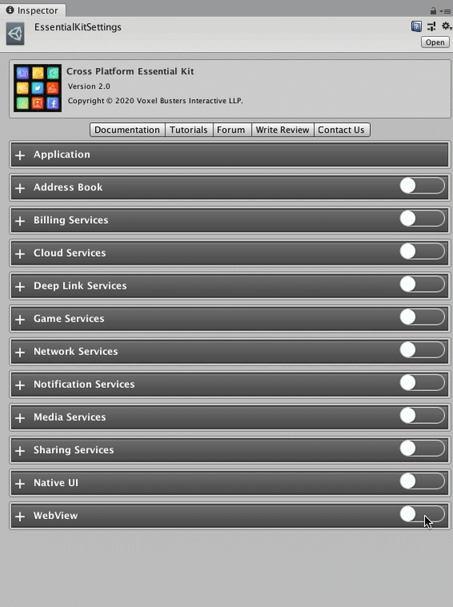

# Setup

## :white\_check\_mark: Enable Feature

Open [Essential Kit Settings](../overview/settings.md) and enable Web View feature in the inspector.

### Properties

| Name               | Description                                                                                           |
| ------------------ | ----------------------------------------------------------------------------------------------------- |
| Android Properties | **Uses Camera** : Enable this if your website needs camera access to capture a picture from web view. |
