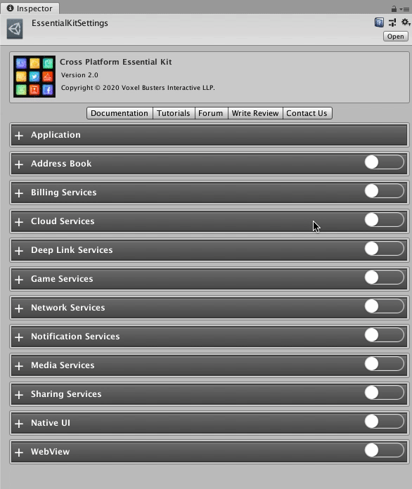

# Setup

### :white\_check\_mark: Enable Feature

Open Essential Kit Settings and enable Address Book feature in the inspector.

#### Properties

| Name          | Description                                                                                                                              |
| ------------- | ---------------------------------------------------------------------------------------------------------------------------------------- |
| Default Image | Set the default texture so that this will be used in-case an image is not available for a contact. Usually this is a profile silhouette. |
