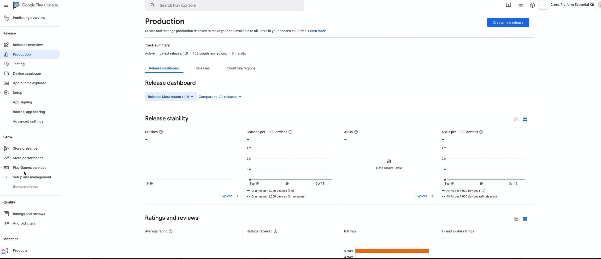

# Android

On Android, Plugin uses **Saved Games feature** of Play Games Services. Internally, Cloud services depend on Google play login for user authentication. For this reason it needs Play Services Application Id.


If you are NOT planning to use Game Services along with Cloud Services, you still need to fill the **Play Services Application Id** entry in Game Services settings (and can  disable it).\
\
Check [here](../../game-services/setup/#properties) (Android Properties tab) on how to get Play Services Application Id.



As cloud services on Android uses google play services(Game Services) internally, you need to make sure the required authentication is handled. You can check [here](https://assetstore.essentialkit.voxelbusters.com/game-services/setup/android#configuring-credentials-sha-fingerprint-authentication) on how to add required credentials for Cloud Services to authenticate successfully.


### Enable Saved Games on Play Console

1. Navigate to your app in [**Google play console**](https://play.google.com/apps/publish)
2. Select **Play Game Services section** on left side bar under **Grow**
3. In Setup and Management, select **configuration**
4. Click on **Edit Properties**
5. **Set** Saved Games to **On**
6. Click on **Save Changes**

