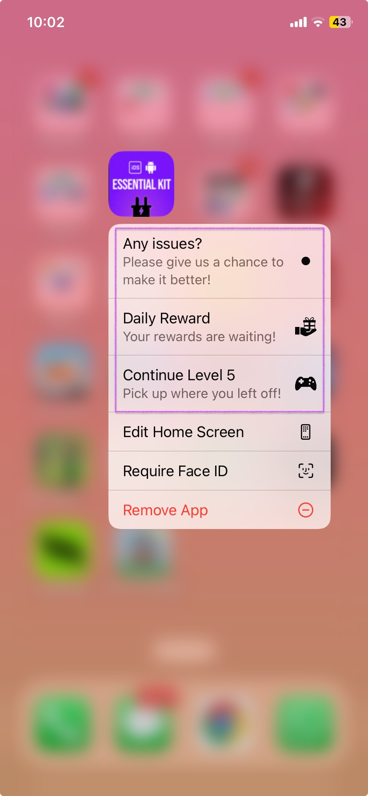
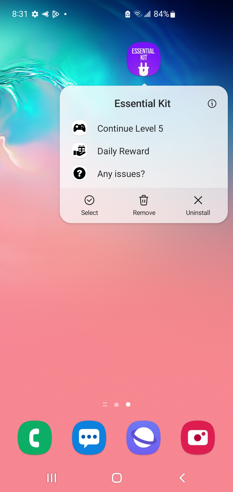

# App Shortcuts

App Shortcuts provides a way to add quick actions to your app icon so that you can take the user directly to the targeted action.

<figure><figcaption>
Shortucts on iOS
</figcaption></figure> <figure><figcaption>
Shortcuts on Android
</figcaption></figure>

### Use-cases

* **Start New Game:** Directly launch a new game session from the app icon.
* **Continue Last Game:** Quickly resume the last played game without navigating through menus.
* **Multiplayer Mode:** Jump straight into the multiplayer lobby or invite friends for a game session.
* **Daily Challenges:** Access daily or weekly challenges directly for quick engagement.
* **Leaderboard Access:** View scores and rankings with a single tap from the home screen.
* **Settings & Preferences:** Quickly access game settings to adjust controls, audio, or display options.
