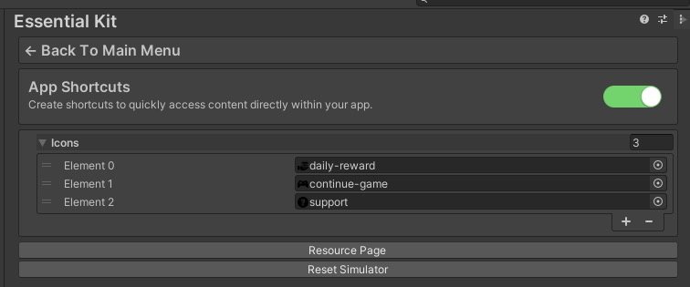

# Setup

### :white\_check\_mark: Enable Feature

Open Essential Kit Settings and enable App Shortcuts feature in the inspector.

If you need to add any icon files for your shortcuts, make sure you add them in the Icons list in settings.

<figure><figcaption>
App Shortcut Settings
</figcaption></figure>

