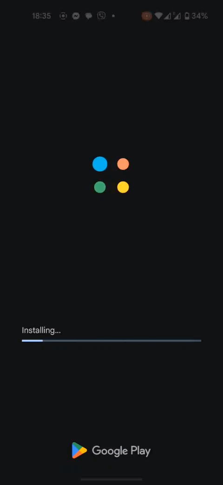

# 🆕 App Updater

Essential Kit's App Updater feature lets Unity teams check for app updates and prompt users without maintaining platform-specific code. This tutorial walks you through setup, key APIs, testing, and troubleshooting so you can keep your users on the latest version with confidence.

<figure><figcaption>
Update Prompt
</figcaption></figure> <figure><figcaption>
Installation
</figcaption></figure>


Looking for a working reference? Open the demo scene at `Assets/Plugins/VoxelBusters/EssentialKit/Examples/Scenes/AppUpdaterDemo.unity` and the companion script at `Assets/Plugins/VoxelBusters/EssentialKit/Examples/Scripts/AppUpdaterDemo.cs` to see the full API in action.


## What You'll Learn

* Check for available updates programmatically
* Show customizable update prompts with optional or forced updates
* Handle in-app updates on Android with progress tracking
* Direct users to app stores on iOS for updates

## Why App Updater Matters

* **Version Control**: Ensure users are on versions compatible with your backend
* **Bug Fixes**: Push critical bug fixes by requiring updates
* **Feature Adoption**: Drive users to new features with optional update prompts
* **Security**: Enforce security patches through mandatory updates

## Tutorial Roadmap

1. [Setup](setup.md) – Enable the feature and configure app store identifiers
2. [Usage](usage.md) – Check for updates, show prompts, handle different update flows
3. [Testing](testing.md) – Test update detection in editor and verify on devices

## Key Use Cases

* **Critical Bug Fixes**: Force users to update before continuing
* **Optional Updates**: Suggest new features without blocking gameplay
* **Version Compatibility**: Ensure minimum app version for server compatibility
* **Soft Launch**: Control rollout by prompting updates to beta testers first

## Prerequisites

* Unity project with Essential Kit v3 installed and App Updater feature included in the build
* iOS or Android target platform with valid app store identifiers configured
* Published app on App Store or Google Play for testing update detection


[setup.md](setup.md)



[usage.md](usage.md)



[testing.md](testing.md)

