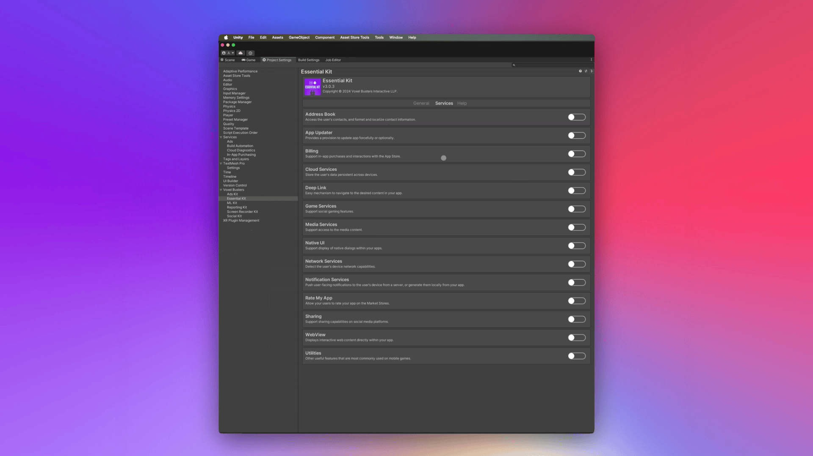

# Setup

## :white\_check\_mark: Enable Feature

Open [Essential Kit Settings](../../plugin-overview/settings.md) and enable Native UI feature in the inspector.

<figure><figcaption>
Native UI Settings
</figcaption></figure>

