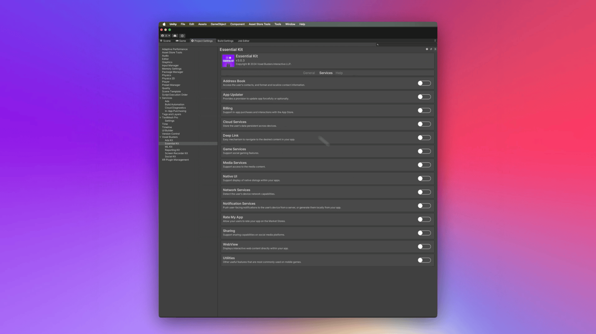

# Setup

## :white\_check\_mark: Enable Feature

Open [Essential Kit Settings](../../plugin-overview/settings.md) and enable Sharing Services in the inspector.

<figure><figcaption>
Sharing Services Settings
</figcaption></figure>
