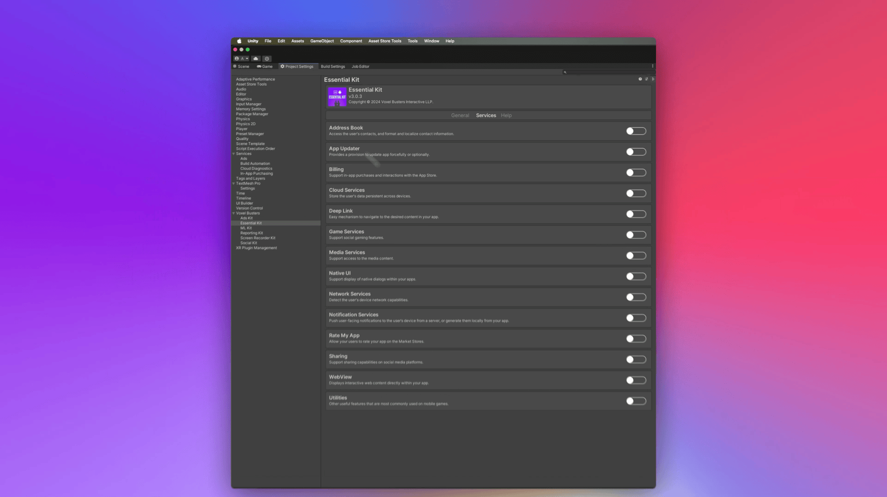

# 🛠️ Utilities (Extras)

Plugin offers additional utilities such as

* Opening application settings screen
* Open market store page

<figure><figcaption>
Utilities Settings
</figcaption></figure>


[usage.md](usage.md)


