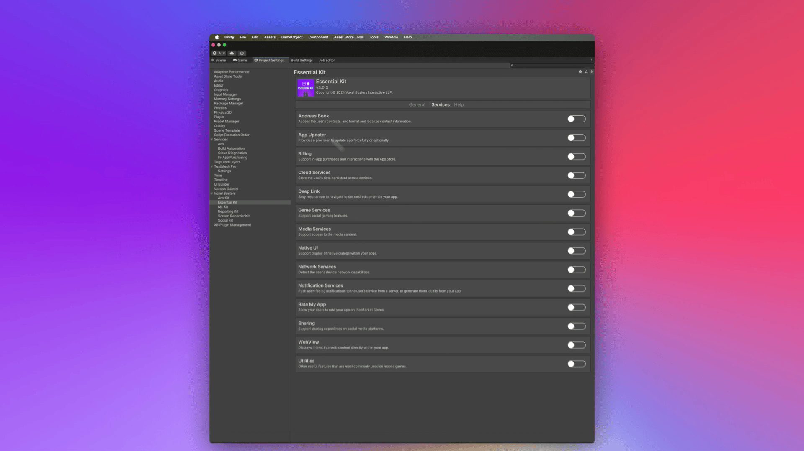

# Setup

## Prerequisites
- Essential Kit imported into the project from My Assets section of Package Manager
- iOS App Store ID configured (numeric value from App Store Connect)
- Android package name configured (bundle identifier format)

## Setup Checklist
1. Open **Essential Kit Settings** (`Window > Voxel Busters > Essential Kit > Open Settings`), switch to the **Services** tab, and enable **Utilities**
2. Configure app store identifiers in the **General** tab under **Application Settings**
3. If you will call `Utilities.RequestInfoForAgeCompliance`, enable **Uses Age Compliance Api** under **Services > Utilities** (dependencies for iOS Declared Age APIs and Android Play Age Signals are added automatically)
4. Changes are saved automatically. If you use source control, commit the updated `Resources/EssentialKitSettings.asset` file

<figure><figcaption>
Utilities Settings
</figcaption></figure>

### Configuration Reference

| Setting | Platform | Required? | Notes |
| --- | --- | --- | --- |
| Is Enabled | All | Yes | Toggles utilities in builds; disabling strips related code |
| iOS App Store ID | iOS | Yes | Numeric ID from App Store Connect (e.g., "1234567890") |
| Android Package Name | Android | Yes | Same as bundle identifier (e.g., "com.company.appname") |
| Uses Age Compliance Api | iOS, Android | Optional | Required for `RequestInfoForAgeCompliance`; adds platform age-signal dependencies automatically |


App Store IDs are configured once in General settings and shared across features like Rate My App and Utilities. No need to configure them multiple times.

