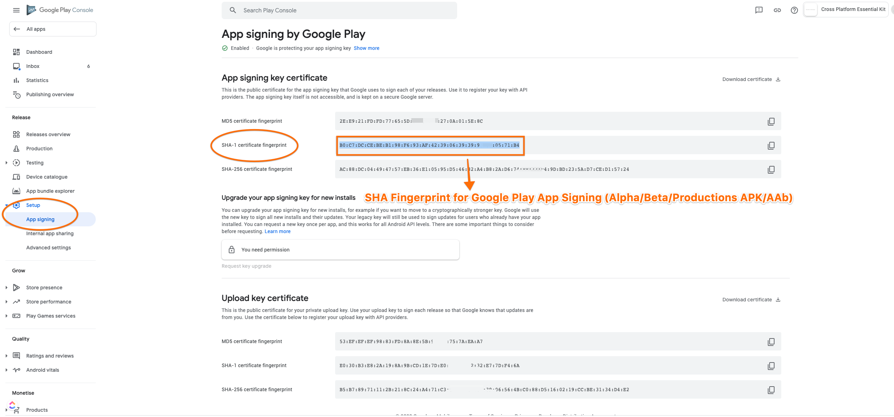

# FAQ

## Common

### What are settings required for making Game Services to work?

#### Android

* Play Services Application Id
* [Add SHA Fingerprint for the APK in Google Play Console](setup/android.md#configuring-credentials-sha-fingerprint-authentication)

#### iOS

* Make sure Game Services capability is enabled when you create your app id manually in iOS developer portal

## Android

### What are different SHA fingerprints that needs to be used for logging in successfully on different environments and how to create them?

Each keystore is linked to a SHA fingerprint. Please check below for creating SHA fingerprints on each environment (Debug, Release and Google play)



When development mode is enabled in Build Settings on Unity, it always uses defualt debug.keystore.\



```bash
  keytool -list -v -keystore "PATH_TO_DEBUG_KEYSTORE" -alias androiddebugkey -storepass android -keypass android
```


Check the below table to get  **PATH\_TO\_DEBUG\_KEYSTORE** (debug.keystore)

| Platform | Path                                                                                                  |
| -------- | ----------------------------------------------------------------------------------------------------- |
| Windows  | <p>C:\Users\USERNAME\.android\debug.keystore</p><p>(Replace with your username in the above path)</p> |
| MacOSX   | \~/.android/debug.keystore                                                                            |





When development mode is **OFF** its considered to be in release mode. And unity uses the keystore you set in the player settings.


```bash
keytool -list -v -keystore "PATH_TO_KEYSTORE" -alias ALIAS_NAME -storepass STORE_PASSWORD -keypass KEY_PASSWORD
```


**PATH\_TO\_KEYSTORE** : This is the path of the keystore you created for your app.





Once you upload your apk to play console, you are given an option to let google sign your apk. This is usually called google play signing and its **recommended** to enable it.\
\
Once your app is ready for testing through testing tracks(Alpha/Beta) or production, you need to add the SHA fingerprint once your app signs with google play signing. You can fetch this fingerprint by following below steps

1. Navigate to [Google Play Console](https://play.google.com/apps/publish) and select your app
2. Select Setup and click on App Signing. Under **App signing key certificate** copy the value of SHA-1 certificate fingerprint
3. Use this fingerprint value in the [credentials section to create a new oauth client id](setup/android.md#configuring-credentials-sha-fingerprint-authentication).\
   \
   &#x20;&#x20;





### Why is sign-in failing? **Or**

### **In the logs I see "**_**APP NOT CORRECTLY CONFIGURED TO USE GOOGLE PLAY GAME SERVICES**_**". How to solve this?**

This usually happens for one of the 3 main reasons.

1. Your package name and certificate fingerprint do not match the client ID you registered in Developer Console. **This means you haven't added the required SHA fingerprint correctly. You need to copy the printed SHA1 fingerprint  in the logcat log and** [**add it in the credentials section of google play console.**](setup/android.md#adding-a-sha-fingerprint)\

2. Your Play Services Application Id was incorrectly entered in [Essential Kit Settings](setup/#properties)\

3. In sandbox mode, the user you are trying to login is not added as a tester in your App's google play console under Play Games Services -> Setup and Management -> Testers


Nearly 99% of the sign in errors are due to not adding the correct credential for the keystore that is used in Google Play Console-> Your App -> Play Games Services -> Setup and Management -> Configuration.&#x20;


For logging in successfully, you need to create the credential by setting the right SHA fingerprint on google play console. Please check setup [here](setup/android.md#configuring-credentials-sha-fingerprint-authentication).

### How to get SHA fingerprint from an APK?

You can use the below command for getting the SHA fingerprint quickly

```bash
keytool -printcert -jarfile PATH_TO_APK_FILE
```

### Why am I getting "keytool command not found"?

You need to have your **JAVA\_HOME** environment variable set on windows or java should be in the PATH on mac.

**keytool** is a program from java sdk and you need to have java setup correctly to get it detected. Its used for getting SHA fingerprint from keystore or an APK.

## iOS

### Why the sign-in dialog doesn't come up second time post user cancelling the sign-in first time?

This is an issue at iOS level which we don't have control. It's a limitation with Game Center and it won't show up the sign-in prompt once user cancels it earlier.

To resolve, user needs to manually sign-in from the settings of his device.

