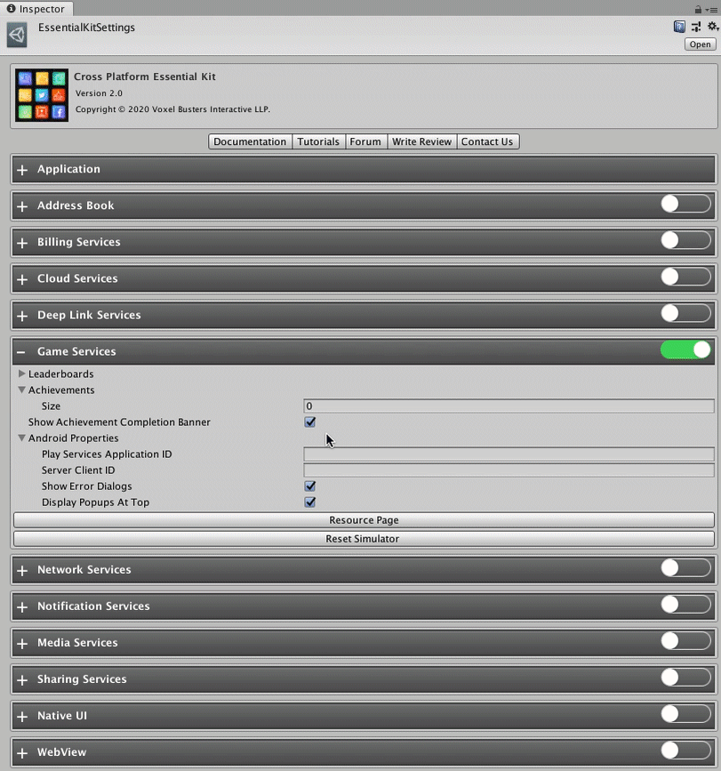

# Setup

### :white\_check\_mark: Enable Feature

Open [Essential Kit Settings](../../plugin-overview/settings.md) and enable Game Services feature in the inspector.

### Properties



| Name                               | Description                                                          |
| ---------------------------------- | -------------------------------------------------------------------- |
| Leaderboards                       | List of leaderboards for your game goes here                         |
| Achievements                       | List of achievements for your game goes here                         |
| Show Achievement Completion Banner | This is used (on iOS) to show a banner once achievement is completed |
| Android Properties                 | Properties specific to Android goes here                             |



#### Leaderboard Properties

| Name                  | Description                                                                                                                                                                |
| --------------------- | -------------------------------------------------------------------------------------------------------------------------------------------------------------------------- |
| **Id**                | 
This is the identifier you use to refer the leaderboard within your code

With this id, you can refer the leaderboard irrespective of the platform you are on.
 |
| **Platform Id**       | This is the identifier which is specific to a platform. Usually these are the id's you see in iTunes Connect and Google Play Game Services dashboards.                     |
| Platform Id Overrides | If the platform id is not same among all platforms, you can set id per platform. Just enter the specific id under the listed platform.                                     |
| Title                 | Title for this leaderboard                                                                                                                                                 |



#### Achievement Properties

| Name                          | Description                                                                                                                                                                                                                      |
| ----------------------------- | -------------------------------------------------------------------------------------------------------------------------------------------------------------------------------------------------------------------------------- |
| **Id**                        | 
This is the identifier you use to refer the achievement within your code

With this id, you can refer the leaderboard irrespective of the platform you are on.
                                                       |
| **Platform Id**               | This is the identifier which is specific to a platform. Usually these are the id's you see in iTunes Connect -> Game Center and Google Play Game Services dashboards.                                                            |
| Platform Id Overrides         | If the platform id is not same among all platforms, you can set id per platform. Just enter the specific id under the listed platform.                                                                                           |
| Title                         | Title for this achievement                                                                                                                                                                                                       |
| **Number of Steps to Unlock** | If the achievement is an incremental achievement (an achievement which needs steps to complete it), you need specify the number of steps it takes to finish this achievement. For one-shot achievements, this value should be 1. |



#### Android Properties

| Name                             | Description                                                                                                                                                                                                                                                                                                                                                                                                                                                                                                                                                              |
| -------------------------------- | ------------------------------------------------------------------------------------------------------------------------------------------------------------------------------------------------------------------------------------------------------------------------------------------------------------------------------------------------------------------------------------------------------------------------------------------------------------------------------------------------------------------------------------------------------------------------ |
| **Play Services Application Id** | 
This is the project id mentioned for your app in Google Play Console ->  Grow section -> Play Games Services -> Setup and Management -> Configuration

ex: 113386462231
                                                                                                                                                                                                                                                                                                                                                                                      |
| Server Client Id                 | 
In Google Play Console ->  Grow section -> Play Games Services -> Setup and Management -> Configuration, Add a credential for web and set the value of Authorization -> OAuth Client id here.

This is optional and is <strong>only required</strong> if you access play services from your backend.    ⚠️ If you set this id from non-web app oauth client, <strong>sign-in fails</strong>.

ex: 113386462231-pn0ikkcmrxxxxup8gben.apps.googleusercontent.com
 |
| Show Alert Dialogs               | Enabling this will show alerts UI related to sign in failure and other possible errors.                                                                                                                                                                                                                                                                                                                                                                                                                                                                                  |
| Display Popups at Top            | Enabling this will show all banners (Achievement revealed, unlocked) at top. Else at bottom.                                                                                                                                                                                                                                                                                                                                                                                                                                                                             |




On iOS, there is a feature to move leaderboards and achievements to groups. Considering you may deploy your game to other platforms(OSX) in future, its good to move them to groups from start. This avoids changing them later once you have your other versions live.

Achievements/Leaderboards  in groups need to start with "grp." prefix and should be unique. We suggest to follow something like **"grp.com.companyname.gamename.leaderboardname"**. Ex: "grp.com.voxelbusters.flappybird.highscoreleaderboard"


